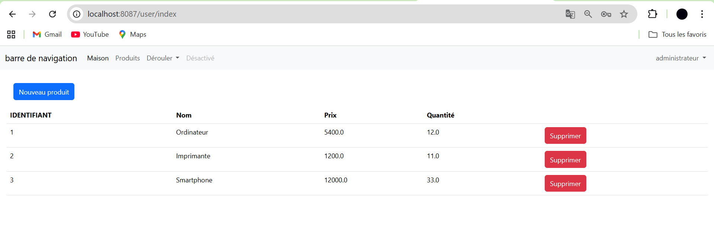
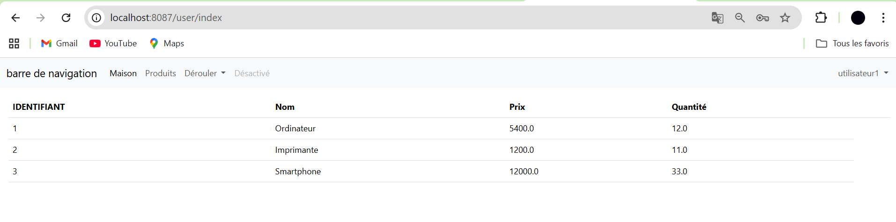
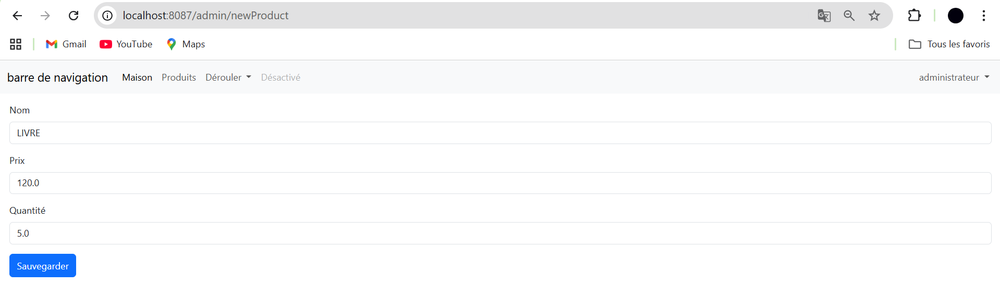
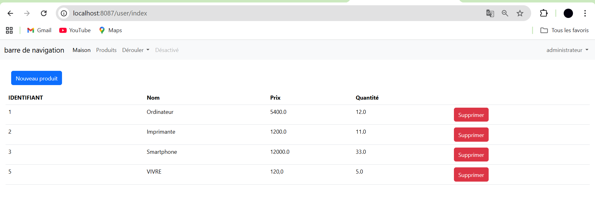
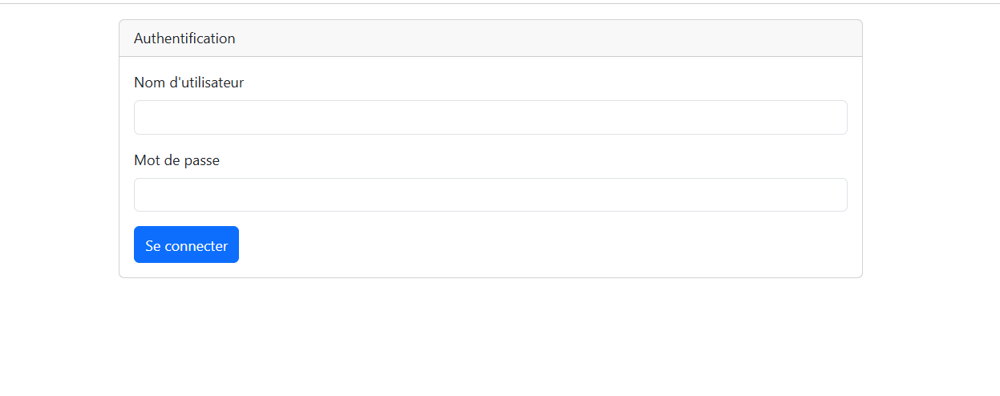

# Application Web JEE – Gestion des Produits avec Spring Boot

## Objectif
Réaliser une application Web JEE basée sur **Spring Boot** permettant la gestion des produits.  
L’application utilise **Spring MVC**, **Spring Data JPA**, **Hibernate**, **Thymeleaf** et **Spring Security**, et permet d’effectuer les principales opérations CRUD avec sécurisation et validation des données.

---

## Technologies et dépendances utilisées
- Spring Boot
- Spring Web
- Spring Data JPA
- Hibernate
- Thymeleaf
- Spring Security
- Spring Validation
- Lombok
- H2 Database
- MySQL
- Bootstrap (interface utilisateur)

---

## Fonctionnalités réalisées

### 1. Création du projet Spring Boot
Le projet a été créé avec les dépendances suivantes :
- Spring Web
- Spring Data JPA
- H2
- MySQL
- Thymeleaf
- Lombok
- Spring Security
- Spring Validation

---

### 2. Création de l’entité JPA `Product`
Une entité `Product` a été créée avec les annotations JPA afin de représenter un produit dans la base de données.  
Elle contient les attributs nécessaires (id, nom, prix, quantité) ainsi que les annotations de validation.

---

### 3. Création de l’interface `ProductRepository`
L’interface `ProductRepository` étend `JpaRepository` afin de bénéficier des méthodes CRUD fournies par Spring Data JPA, sans implémentation manuelle.

---

### 4. Test de la couche DAO
La couche DAO a été testée pour vérifier :
- L’insertion des produits
- La récupération de la liste des produits
- La suppression et la mise à jour des produits

---

### 5. Désactivation de la protection par défaut de Spring Security
La configuration par défaut de Spring Security a été désactivée temporairement afin de faciliter le développement et le test des fonctionnalités de base.

---

### 6. Création du contrôleur Spring MVC et des vues Thymeleaf

Les fonctionnalités suivantes ont été implémentées :

- Affichage de la liste des produits

- Suppression d’un produit
- Page template basée sur **Thymeleaf Layout**
- Interface utilisateur stylisée avec **Bootstrap**

- Formulaire de saisie et d’ajout d’un produit

- Validation des formulaires avec **Spring Validation**

---

### 7. Sécurisation de l’application avec Spring Security
L’application a été sécurisée en utilisant Spring Security :
- Authentification des utilisateurs
  
- Gestion des rôles
- Restriction de l’accès à certaines fonctionnalités selon les rôles
   VS 
---

## Organisation du projet
Le projet est structuré selon une architecture en couches :
- `entities` : entités JPA
- `repositories` : interfaces Spring Data
- `controllers` : contrôleurs Spring MVC
- `security` : configuration Spring Security
- `templates` : vues Thymeleaf

---

## Conclusion
Ce projet a permis de mettre en pratique les concepts fondamentaux du développement Web JEE avec Spring Boot, notamment la persistance des données avec JPA, la création d’interfaces dynamiques avec Thymeleaf, ainsi que la sécurisation des applications avec Spring Security.

---
